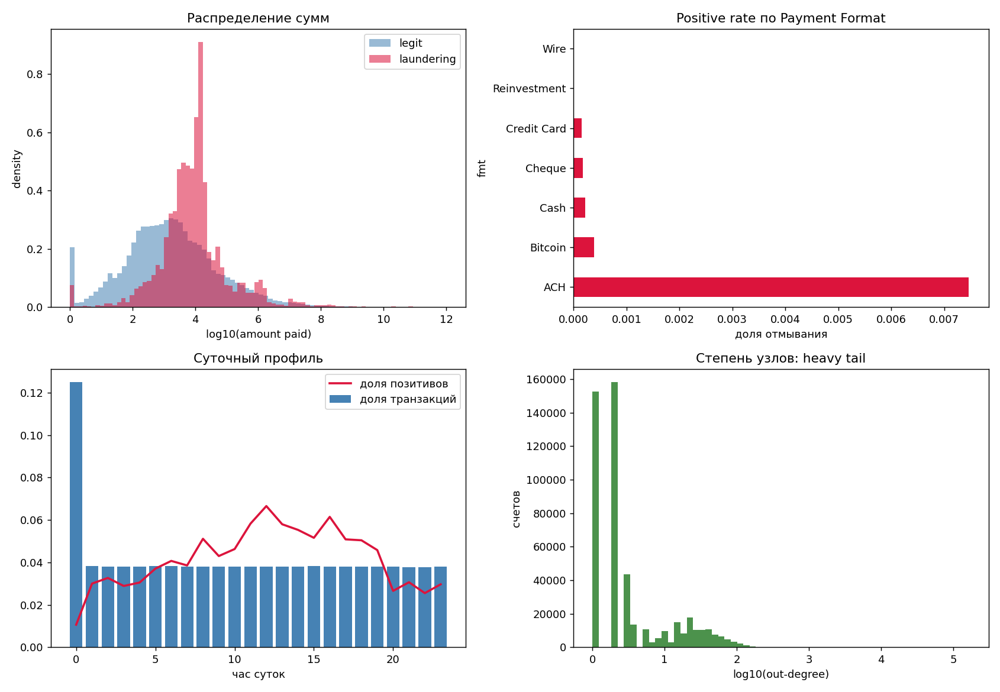
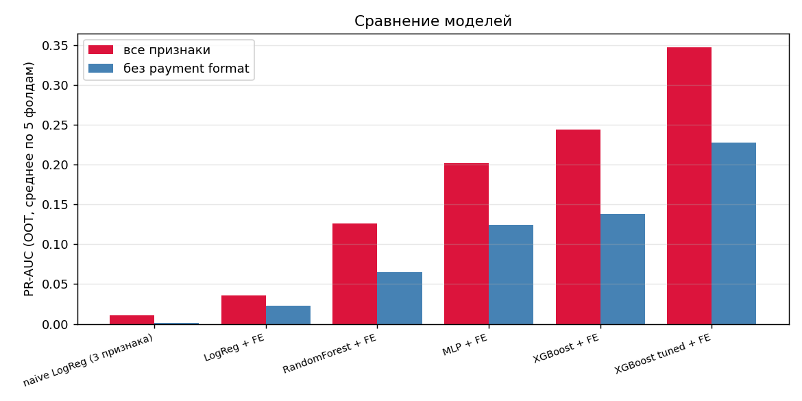
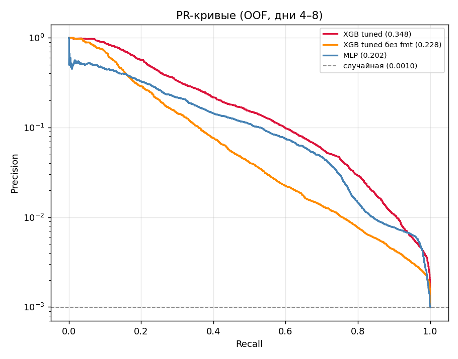
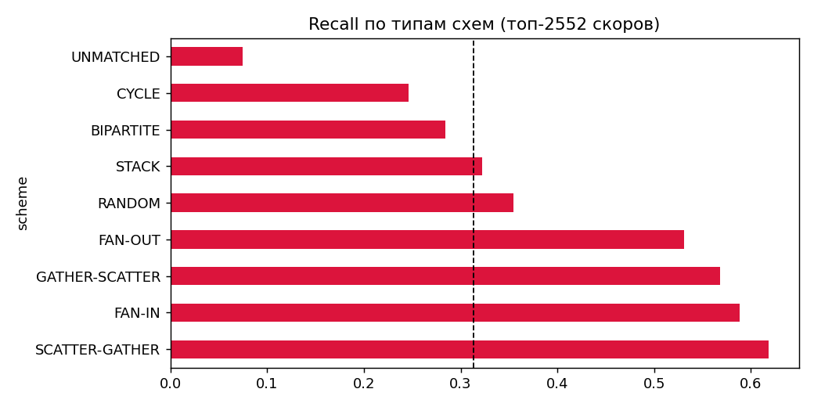
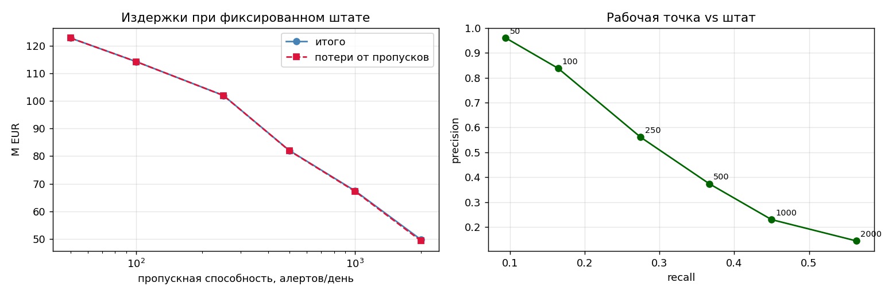
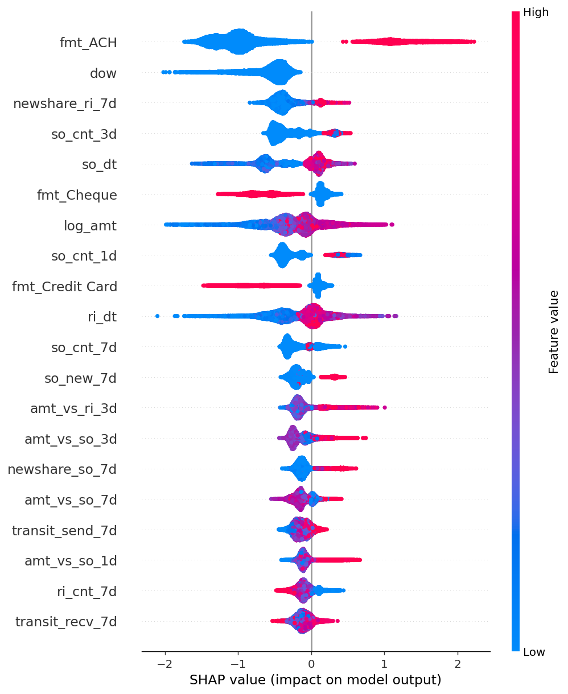

# Детекция отмывания денег на транзакционном графе

[](https://colab.research.google.com/github/mmmaximov/aml-transaction-graph/blob/main/aml_detection.ipynb)
[](https://opensource.org/licenses/MIT)
[](https://www.kaggle.com/datasets/ealtman2019/ibm-transactions-for-anti-money-laundering-aml)
[](#сводная-таблица-out-of-time-5-фолдов)
[](#honest-holdout)
[](#бизнес-метрики)

**Детектор отмывания денег на 5 млн транзакций при дисбалансе 1:1122. Графовая топология переводов переведена в 86 табличных признаков через скользящие окна на префиксных суммах. Error analysis по типам схем показывает, что модель видит аномальные узлы и слепа к аномальным путям. Всё на бесплатном Colab T4.**

---

## TL;DR

Отмывание выглядит как обычный перевод. Отдельная транзакция на 8 тысяч евро между двумя счетами не несёт в себе ничего подозрительного — подозрительна **последовательность**: счёт, которого вчера не существовало, за три дня разослал деньги двадцати новым получателям, а те немедленно переслали их дальше. Значит задача не в том, чтобы классифицировать перевод, а в том, чтобы **описать поведение счёта вокруг перевода**, и сделать это, не заглядывая в будущее.

Здесь это сделано вручную: каждая транзакция описывается четырьмя профилями поведения (что отправитель рассылал и получал раньше, что получатель получал и рассылал), три временных окна, счётчики новых контрагентов. Скользящие окна на 5 млн строк и 497 тысячах счетов считаются **за 40 секунд** через `np.searchsorted` по префиксным суммам, потому что `groupby().rolling()` такого размера в память не помещается.

**Результат:** PR-AUC вырос с 0.0112 у наивного бейзлайна до **0.3461**, в **31 раз**. На отложенном дне, который не видели ни валидация, ни подбор гиперпараметров, — **0.4617**. Практический смысл: при 100 алертах в день **84% из них оказываются настоящим отмыванием**.

**Что здесь можно посмотреть помимо метрик:**

- **error analysis по типам схем** обнаружил систематический провал: звёздчатые схемы (fan-in, fan-out, gather-scatter) детектируются с recall 0.52–0.60, цепочечные (cycle, stack, bipartite) — 0.25–0.32; разделение по качеству **в точности совпадает** с разделением по топологии, и это следствие того, что все признаки ограничены одним хопом;
- **измерена цена артефакта данных**: у каналов Wire и Reinvestment ровно ноль позитивов на 653 тысячи транзакций — симулятор просто не генерирует через них схемы, поэтому все метрики считаются в двух режимах, с этим признаком и без; честная оценка переносимости — **0.2282, а не 0.3461**;
- при разборе данных найден **краевой эффект симулятора**: в последних восьми днях доля отмывания 59% против 0.089% в основной части, потому что легитимный трафик обрывается, а начатые схемы доигрывают свои переводы;
- **опровергнута дефолтная практика работы с дисбалансом**: оптимальный `scale_pos_weight ≈ 100` вместо канонического `neg/pos ≈ 1000`, полная компенсация раздувает recall в ущерб ранжированию;
- **корректность оконных признаков проверена брутфорсом** (200/200 совпадений), а не заявлена;
- показано, что **стандартная оптимизация порога по ожидаемым издержкам вырождается** на распределении с тяжёлым хвостом: формальный оптимум требует 18 тысяч алертов в день;
- **отрицательный результат по стекингу** не спрятан, а объяснён.

Данные банковские, но постановка общая: она про то, как из графа взаимодействий с временными метками сделать признаки, не допустив утечки из будущего.

---

## Задача

Дана транзакция $x_t = (u \to v,\ a,\ t)$: перевод суммы $a$ со счёта $u$ на счёт $v$ в момент $t$. Требуется предсказать $y_t \in \{0, 1\}$ — является ли перевод частью схемы отмывания.

Ключевое ограничение — **причинность**. Признаки транзакции в момент $t$ могут использовать только историю $\mathcal{H}_t = \{x_s : s < t\}$. Нарушение этого условия даёт модель, которая прекрасно работает на бэктесте и бесполезна в проде.

Формально каждый признак есть функция вида

$$\phi(x_t) = g\big(\{x_s \in \mathcal{H}_t : \text{acct}(x_s) = \text{acct}(x_t),\ t - s < W\}\big)$$

для окна $W \in \{1, 3, 7\}$ дней и агрегатора $g$ (количество, сумма, среднее, число новых контрагентов).

Метрика — **PR-AUC**. При базовой частоте 0.089% ROC-AUC вводит в заблуждение: он усредняет по всем порогам, включая заведомо нерабочие области, и остаётся высоким у моделей, непригодных на практике. Accuracy тем более бесполезна — константный ответ «не отмывание» даёт 99.91%.

## Что где в ноутбуке

| Компонент | Что применяется | Раздел |
|---|---|---|
| Скользящие окна | `searchsorted` по префиксным суммам, O(n log n) без `groupby` | 4.2 |
| Новые контрагенты | Замена невычислимому в окне `nunique`, оказалась сильнее счётчиков | 4.3 |
| Проверка причинности | Брутфорс-сверка оконных признаков на 200 транзакциях | 4.7 |
| Expanding-window OOT | 5 фолдов, ранняя остановка на последнем дне обучающего окна | 3.1 |
| Работа с дисбалансом | `scale_pos_weight` с подобранным множителем, отказ от SMOTE | 8, 9 |
| GPU-обучение | `QuantileDMatrix`, биннинг в 1 байт вместо 4 | 8 |
| Error analysis | Recall отдельно по 8 типам паттернов отмывания | 13 |
| Ablation по признакам | Переобучение без каждого семейства | 16 |
| Интерпретируемость | SHAP summary + разбор конкретного алерта | 14 |
| Бизнес-метрики | Precision@K, издержки при фиксированном штате | 15 |

## Данные

[IBM Transactions for Anti Money Laundering](https://www.kaggle.com/datasets/ealtman2019/ibm-transactions-for-anti-money-laundering-aml), файл `HI-Small_Trans.csv`. Синтетические банковские логи, сгенерированные симулятором AMLSim.

| Параметр | Значение |
|---|---|
| Транзакций (после усечения) | 5 077 237 |
| Позитивов | 4 522 (0.089%) |
| Дисбаланс | 1 : 1122 |
| Уникальных счетов | 496 995 |
| Банков | 30 470 |
| Период | 10 суток (усечено с 18) |
| Признаков после FE | 86 |
| Типов схем отмывания | 8 (370 размеченных паттернов) |

Взята `HI`-версия (high illicit ratio), а не `LI`: при дисбалансе 1:1122 ещё более редкий позитивный класс сделал бы оценку неустойчивой. Файлы Medium и Large не помещаются в 12.7 ГБ RAM бесплатного Colab.

**Про усечение.** Исходно в данных 18 суток, но легитимный трафик обрывается в середине 10-го дня, а транзакции отмывающих схем тянутся ещё неделю: в днях 10–17 остаётся 1108 транзакций, из которых 655 позитивных. Это край окна симуляции — схемы, начатые под конец периода, доигрывают свои переводы после остановки фоновой генерации. Валидация на таком хвосте измеряла бы артефакт, поэтому данные усечены по день 9. День 0 (инициализирующий burst симулятора) не используется как обучающий, но остаётся историей для скользящих окон.



Слева вверху видно, зачем нужен клип суммы на `1e-6`, а не на единицу: у легитимных транзакций есть отдельная масса около нуля, которую иначе схлопнуло бы в одну точку. Справа вверху — то самое доминирование ACH: 11.8% транзакций и 86.6% позитивов, при нулях у Wire и Reinvestment. Внизу справа heavy tail по степеням узлов: есть счета со 100 тысячами исходящих переводов, и это определяет, как считать оконные агрегации.

## Признаки

### Четыре профиля поведения

Каждая транзакция порождает два события: исходящее для отправителя и входящее для получателя. Для каждой транзакции запрашивается четыре профиля:

| префикс | что описывает | какую схему ловит |
|---|---|---|
| `so_` | отправитель: что рассылал раньше | fan-out, scatter |
| `si_` | отправитель: что получал раньше | приток перед рассылкой |
| `ri_` | получатель: что получал раньше | fan-in, gather |
| `ro_` | получатель: что рассылал раньше | транзитный счёт |

Пара `ri_` + `ro_` задумывалась как прямой детектор счёта-прокладки: деньги втекают и почти сразу вытекают, отношение объёмов близко к единице при большом обороте. По важности эта группа оказалась последней — см. [что не сработало](#что-не-сработало).

### Как это считается за 40 секунд

Наивный `groupby().rolling()` на 5 млн строк и 497 тысячах групп не помещается в память. Вместо него:

1. события сортируются по `(счёт, время)` и кодируются одним `int64`-ключом `acct * 2^20 + ts`;
2. границы окна находятся **двумя `np.searchsorted`** сразу по всему массиву, без единого цикла по счетам;
3. суммы в окне берутся как разность префиксных сумм на границах.

Сложность O(n log n), пик памяти — сотни мегабайт вместо десятков гигабайт.

### Новые контрагенты вместо nunique

Точный `nunique` в скользящем окне через префиксные суммы не считается: множество не аддитивно. Вместо него — **число контрагентов, с которыми счёт раньше вообще не взаимодействовал**. Оно аддитивно (первое появление пары помечается единицей, дальше обычный `cumsum`) и потому вычислимо тем же приёмом.

Это оказалось не компромиссом ради памяти, а **лучшим признаком**: по суммарному gain семейство «новые контрагенты» уступает только каналу платежа и обходит классические счётчики fan-out. Содержательно понятно почему — рассылка на свежие счета есть прямая подпись fan-out на подставных лиц.

## Результаты

### Сводная таблица (out-of-time, 5 фолдов)

| Модель | PR-AUC | без `payment format` | lift | Время, с/фолд |
|---|---|---|---|---|
| naive LogReg (3 сырых признака) | 0.0112 | 0.0017 | ×12.6 | 12 |
| LogReg + FE | 0.0362 | 0.0195 | ×40.6 | 95 |
| RandomForest + FE | 0.1262 | 0.0647 | ×141.7 | 970 |
| MLP + FE | 0.2023 | 0.1367 | ×227.2 | 109 |
| XGBoost + FE | 0.2442 | 0.1381 | ×274.2 | 15 |
| **XGBoost tuned + FE** | **0.3461** | **0.2282** | **×388.7** | 54 |
| Ранговый бленд (XGB + MLP) | 0.3291 | — | ×369.6 | 0 |
| Stacking (meta-LogReg) | 0.3227 | — | ×362.3 | 0 |

Разложение прироста: ручные признаки дали ×3.2, смена класса модели ×6.7, подбор гиперпараметров ×1.4. Второй множитель больше первого, но это не значит, что FE второстепенен: колонка «без format» показывает ×134 на одних только вручную построенных признаках — бустингу нечего было бы комбинировать без них.

**XGBoost в 18 раз быстрее RandomForest при втрое лучшем качестве** (54 с против 970 с). Причём RandomForest обучался на прореженных негативах, а XGBoost на GPU — на полной выборке.



Разрыв между парой столбцов у каждой модели — это и есть вклад канала платежа. Он не постоянный: у наивного бейзлайна сигнал держится на нём почти целиком (0.0112 против 0.0017, разница в 6.5 раз), у финального бустинга канал добавляет уже только 1.5 раза. Чем богаче поведенческие признаки, тем меньше модель зависит от артефакта генератора.



Precision в логарифмической шкале, иначе при базовой частоте 0.089% все кривые прижались бы к нулю. Практически значима левая часть графика: в области recall до 0.2 бустинг держит precision выше 0.8, и именно там работает комплаенс-отдел.

### Honest holdout

День 9 не участвовал ни в одном фолде валидации и не был виден Optuna.

| | PR-AUC | lift |
|---|---|---|
| Среднее по 5 OOT-фолдам | 0.3461 | ×388.7 |
| **Holdout (день 9)** | **0.4617** | **×217.6** |

Качество на holdout **выше** среднего по фолдам, то есть подгонки под валидацию нет. Разница объясняется длиной обучающей истории: на дне 9 модель видит 8 предшествующих дней против 3–7 в ранних фолдах.

### Recall по типам отмывающих схем

Порог — топ-2552 скора, что равно числу позитивов в валидационном пуле. Общий recall 0.307.

| Схема | Позитивов | Recall | Топология |
|---|---|---|---|
| SCATTER-GATHER | 325 | **0.600** | звёздчатая |
| FAN-IN | 158 | **0.576** | звёздчатая |
| GATHER-SCATTER | 287 | **0.547** | звёздчатая |
| FAN-OUT | 130 | **0.515** | звёздчатая |
| RANDOM | 96 | 0.333 | смешанная |
| STACK | 298 | 0.315 | цепочечная |
| BIPARTITE | 116 | 0.284 | цепочечная |
| CYCLE | 142 | 0.254 | цепочечная |
| UNMATCHED | 1000 | 0.079 | периферия схем |



Пунктир — общий recall 0.307. Разрыв ровно вдвое, и граница проходит **точно по топологии**, а не случайно: четыре схемы над пунктиром звёздчатые, три под ним цепочечные.

Чего этот график не показывает: метки схем есть только у позитивов, поэтому сказать, какие типы чаще порождают **ложные** срабатывания, по этим данным нельзя.

### Бизнес-метрики

Пропускная способность комплаенс-отдела фиксирована, поэтому Precision@K содержательнее любого порога.

| Алертов в день | Precision@K | Recall@K | Найдено схем/день |
|---|---|---|---|
| 50 | **0.960** | 0.094 | 48.0 |
| 100 | **0.838** | 0.164 | 83.8 |
| 250 | 0.549 | 0.268 | 137.2 |
| 500 | 0.368 | 0.359 | 184.0 |
| 1000 | 0.231 | 0.452 | 231.4 |



Слева кривые «итого» и «потери от пропусков» практически сливаются: затраты на разбор (0.5–428 тыс. EUR) на два-три порядка меньше потерь от пропусков (52–123 млн EUR). Значит узкое место — не стоимость ложных срабатываний, а пропускная способность: модель не экономит на проверках, она **ранжирует очередь**, и каждый дополнительный аналитик окупается многократно.

Справа выбор порога переведён из ML-плоскости в управленческую: точки подписаны размером штата. Рекомендуемая рабочая точка — **250 алертов в день**: каждый второй кейс настоящий, команда не выгорает на ложных срабатываниях и продолжает доверять скорам. При 500+ precision падает ниже 0.4, а это порог доверия к системе.

## Ключевой вывод: почему модель не видит цепочечные схемы

Это не «модель недоучена», а точное утверждение о границах построенного признакового пространства, полученное измерением.

**Шаг 1. Что общего у схем, которые ловятся.** Fan-in, fan-out, gather-scatter, scatter-gather устроены одинаково: существует **один узел**, поведение которого аномально само по себе — счёт внезапно рассылает деньги двадцати получателям или собирает от двадцати отправителей. Аномалия локализована в узле.

**Шаг 2. Что общего у схем, которые не ловятся.** Cycle, stack, bipartite — многохоповые цепочки. Каждая отдельная транзакция в них выглядит совершенно рядовой: перевод типичной суммы между двумя счетами с обычной историей. Аномальна только **последовательность переводов целиком**, то есть топология пути.

**Шаг 3. Что измеряют признаки.** Все 86 признаков — функции от непосредственных контрагентов счёта: сколько отправил, сколько получил, скольким новым, как давно. Ни один не выходит за один хоп. Признакового представления пути в модели нет **по построению**.

**Шаг 4. Что подтверждает измерение.** Recall делится ровно надвое, и граница совпадает с границей по топологии: 0.52–0.60 против 0.25–0.32. Дополнительно `UNMATCHED` (транзакции прикрытия вокруг ядер схем, у которых по определению нет локальной аномалии) даёт 0.079 — худший результат из всех групп, что согласуется с той же логикой.



Независимое подтверждение тем же выводом: SHAP показывает, что после канала платежа модель опирается на `newshare_ri_7d`, `so_cnt_*`, `so_new_7d`, `amt_vs_*` — все они описывают **один узел**, и все работают в ожидаемую сторону (красное, то есть высокие значения, сдвигает предсказание к отмыванию). Ни одного признака про путь в этом списке нет, потому что их не существует.

Отсюда следует направление развития, и оно не «взять модель побольше»: нужны 2-hop признаки или GNN. Увеличение глубины деревьев на этот класс схем не подействует, потому что информации о пути нет во входных данных модели.

## Что не сработало

**Транзитность.** Гипотеза «на счёте-прокладке втекает ≈ вытекает» выглядела как самая содержательная часть feature engineering и оказалась последней по суммарному gain. Вероятная причина: отношение объёмов фиксирует транзит только когда окно точно совпадает со схемой, тогда как `so_new_*` ловит ту же схему устойчивее и вытесняет транзитность из разбиений.

**Ансамблирование.** Ни ранговый бленд (0.3291), ни мета-модель (0.3227) не обошли одиночный XGBoost (0.3461). MLP обучен на тех же признаках, слабее почти вдвое и ошибается там же, где бустинг. Стекинг помогает, когда модели ошибаются **по-разному** — здесь это условие не выполняется.

**MLP как таковой.** 0.2023 против 0.3461 у бустинга. Признаки здесь счётчиковые, с длинными хвостами и естественными пороговыми эффектами: «больше 15 новых контрагентов за 3 дня» — ступенька, которую дерево выражает одним разбиением, а сеть вынуждена аппроксимировать гладкой функцией при 4.5 тысячах позитивов. Кривые обучения при этом показывают **недообученность, а не переобучение**: валидационный PR-AUC растёт до последней эпохи.

## Инженерные детали, на которых легко ошибиться

**Сквозная нумерация счетов.** Отправители и получатели кодируются **одним** `factorize` по объединённому столбцу. Раздельное кодирование дало бы одному и тому же счёту разные ID в роли отправителя и получателя, и все графовые признаки молча превратились бы в мусор — без единой ошибки в логах.

**Полуоткрытые окна.** `searchsorted(..., "left")` по метке времени исключает события той же минуты, включая саму текущую транзакцию. Ошибка на единицу здесь даёт утечку таргета через собственную транзакцию и фантастический PR-AUC, который разваливается на защите. Проверено брутфорсом: 200/200 совпадений по `so_cnt_1d` и `so_new_1d`.

**Винзоризация только по обучающему периоду.** Перцентили 0.1% / 99.9% считаются по дням 1–8, квантили holdout-дня не подглядываются. До этой правки `lbfgs` не сходился ни на одном фолде: `fx_ratio` доходит до 10¹², `StandardScaler` делил на раздутое выбросами стандартное отклонение, и почти все значения схлопывались в ноль.

**Ранняя остановка при слабом сигнале.** При `learning_rate ≈ 0.02` модель первые десятки итераций почти не улучшается. С `early_stopping_rounds=50` конфигурация без `payment format` останавливалась на **9 деревьях** с PR-AUC 0.018 и занижала весь ablation. Увеличение терпения до 150 подняло тот же фолд до 0.098.

**`max_bin` в двух местах.** В XGBoost 3.x `QuantileDMatrix` биннит данные **при создании**, поэтому `max_bin` обязан быть указан и в конструкторе матрицы, и в параметрах бустера. Расхождение даёт `Check failed: param.max_bin == init.max_bin` уже на этапе обучения, а не при сборке матрицы.

**`FEAT[cols].values` копирует всю матрицу.** Выражение сначала материализует полный `DataFrame` из выбранных колонок (5 млн × 86 float32 ≈ 1.6 ГБ), и только потом берёт нужные строки. В цикле по фолдам это переполняет RAM. Правильный порядок — сначала строки: `FEAT.iloc[idx][cols].values`, а для ablation — `np.ix_` по одной консолидированной матрице.

**Совпадение сумм при мёрдже разметки.** Метки схем лежат в отдельном файле, и сопоставление идёт по составному ключу с двумя суммами. Обе стороны приводятся к `float32`, иначе значения не совпадут побитово и мёрдж молча вернёт пустоту. Сопоставилось 100% пригодных строк: разница с общим числом позитивов ровно равна количеству, отрезанному вместе с днями 10–17.

**Pooled и per-fold PR-AUC несопоставимы.** При сравнении стекинга с одиночной моделью легко напечатать рядом два числа, посчитанных по-разному: одно на объединённом пуле всех дней, другое как среднее по фолдам. Pooled смешивает дни с разной базовой частотой позитивов и даёт систематически другую величину — на этих данных 0.2784 против 0.3461 для одной и той же модели. Вывод «стекинг помогает» из такого сравнения был бы артефактом.

## Ограничения

- **Данные синтетические.** AMLSim генерирует схемы по правилам, и часть сигнала — артефакты генератора. Самый явный: у Wire и Reinvestment ровно ноль позитивов на 653 тысячи транзакций, у кросс-валютных переводов тоже ноль. Модель выучивает `fmt_Wire` как детерминированное отрицательное правило. Честная оценка переносимости — **0.2282** (колонка «без format»).
- **Нестабильность OOT.** Разброс по фолдам ±0.071 при среднем 0.346, то есть 20% относительной вариации. Проверка профиля валидационных дней (доля ACH среди позитивов, медианы сумм) смены режима не выявила, причина не установлена. В продакшене потребовалось бы ансамблирование по временным окнам.
- **Потолок в один хоп.** Признаки не выходят за непосредственных контрагентов счёта, отсюда провал на цепочечных схемах.
- **Вычислительные компромиссы.** RandomForest (300 тыс. негативов), MLP (600 тыс.) и логистическая регрессия (400 тыс.) обучались на прореженных выборках, полная доступна только бустингу на GPU. Подбор гиперпараметров ограничен 13 завершёнными trial-ами на двух фолдах.
- **Один датасет, один seed.** Переносимость на другие банковские данные не проверялась, доверительных интервалов нет.
- **Экономия считается от нуля.** «61% экономии» в бизнес-блоке измерена относительно сценария «не проверяем вообще ничего», а не относительно существующего rule-based процесса банка. Это нижняя граница эффекта.

## Что можно сделать дальше

**2-hop признаки** — прямая атака на вывод про цепочечные схемы: реципрокные рёбра, замкнутость коротких путей, треугольники через булево умножение разреженных матриц на подграфе счетов с высокой степенью.

**GNN** (GraphSAGE, GAT) на графе транзакций — обучение представлений топологии вместо ручного конструирования. Естественное продолжение той же логики: если провал вызван отсутствием информации о пути, её надо дать модели, а не усложнять модель.

**Аккаунт-центричная постановка** — классифицировать счета, а не переводы. Отмывание является свойством счёта, а разметка на уровне транзакций размывает сигнал, и группа `UNMATCHED` с recall 0.079 это прямо показывает.

**Дообучение MLP.** Кривые обучения не вышли на плато, 25–30 эпох дали бы прибавку.

## Структура и запуск

```
aml_detection.ipynb          # весь проект, 17 разделов
README.md
requirements.txt
LICENSE
assets/
    # вынесены в README
    eda_overview.png         # EDA: суммы, каналы, суточный профиль, степени узлов (раздел 2)
    results_summary.png      # сравнение моделей с fmt и без (раздел 17)
    pr_curves.png            # PR-кривые (раздел 17)
    recall_by_scheme.png     # recall по типам схем (раздел 13)
    business_capacity.png    # издержки при фиксированном штате (раздел 15)
    shap_summary.png         # SHAP summary plot (раздел 14)
    # только в ноутбуке
    boxplots.png             # распределения признаков по классам (раздел 5)
    corr_matrix.png          # корреляционная матрица (раздел 5)
    corr_target.png          # связь признаков с таргетом (раздел 5)
    importance.png           # gain importance XGBoost (раздел 10)
    mlp_training.png         # кривые обучения MLP (раздел 11)
    business_naive.png       # вырожденная кривая стоимости (раздел 15)
results/
    results.csv              # сводная таблица метрик
    recall_by_scheme.csv     # error analysis по схемам
    business_capacity.csv    # бизнес-метрики
    feature_importance.csv   # важности признаков
    ablation_groups.csv      # ablation по группам признаков
    meta.json                # гиперпараметры и параметры прогона
```

**Запуск.** Откройте ноутбук в Colab по бейджу выше, включите GPU (`Runtime → Change runtime type → T4 GPU`) и запустите `Run all`. Перед первым запуском положите `kaggle.json` в `~/.kaggle/` (Kaggle → Settings → Create New API Token).

**Окружение.** Бесплатного Colab с T4 достаточно. Дополнительно ставятся `optuna`, `shap`, `kaggle`, остальное предустановлено.

**Время.** Полный прогон 1.5–2 часа: загрузка и конвертация (~5 мин), feature engineering (~1 мин), RandomForest (~35 мин), XGBoost (~5 мин), MLP (~18 мин), ablation (~15 мин), остальное быстро. Основное время съедает RandomForest на двух vCPU — он же худшая модель в таблице, что само по себе аргумент в пользу GPU-бустинга.

**Кэширование.** После первой загрузки данные лежат в `hi_small.parquet`, повторный запуск не перекачивает 454 МБ с Kaggle. Флаг `RUN_OPTUNA` по умолчанию выключен: найденные гиперпараметры зафиксированы в коде, чтобы прогон воспроизводил числа из README. TPE-сэмплер стохастичен, а поиск был ограничен по времени, поэтому повторный запуск дал бы другой оптимум.

## Литература

- Altman et al. **Realistic Synthetic Financial Transactions for Anti-Money Laundering Models.** NeurIPS 2023 Datasets and Benchmarks, [arXiv:2306.16424](https://arxiv.org/abs/2306.16424)
- Suzumura & Kanezashi. **Anti-Money Laundering Datasets: AMLSim.** [github.com/IBM/AMLSim](https://github.com/IBM/AMLSim)
- Chen & Guestrin. **XGBoost: A Scalable Tree Boosting System.** KDD 2016, [arXiv:1603.02754](https://arxiv.org/abs/1603.02754)
- Lundberg & Lee. **A Unified Approach to Interpreting Model Predictions (SHAP).** NeurIPS 2017, [arXiv:1705.07874](https://arxiv.org/abs/1705.07874)
- Weber et al. **Anti-Money Laundering in Bitcoin: Experimenting with Graph Convolutional Networks for Financial Forensics.** [arXiv:1908.02591](https://arxiv.org/abs/1908.02591)
- Akiba et al. **Optuna: A Next-generation Hyperparameter Optimization Framework.** KDD 2019, [arXiv:1907.10902](https://arxiv.org/abs/1907.10902)
